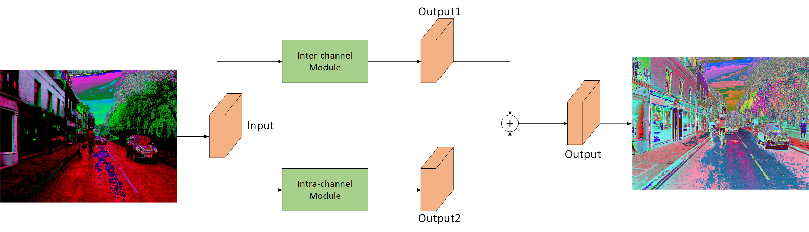
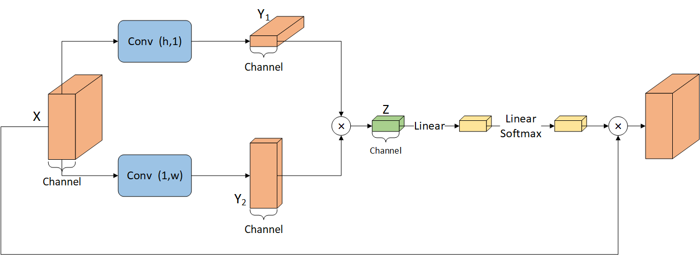
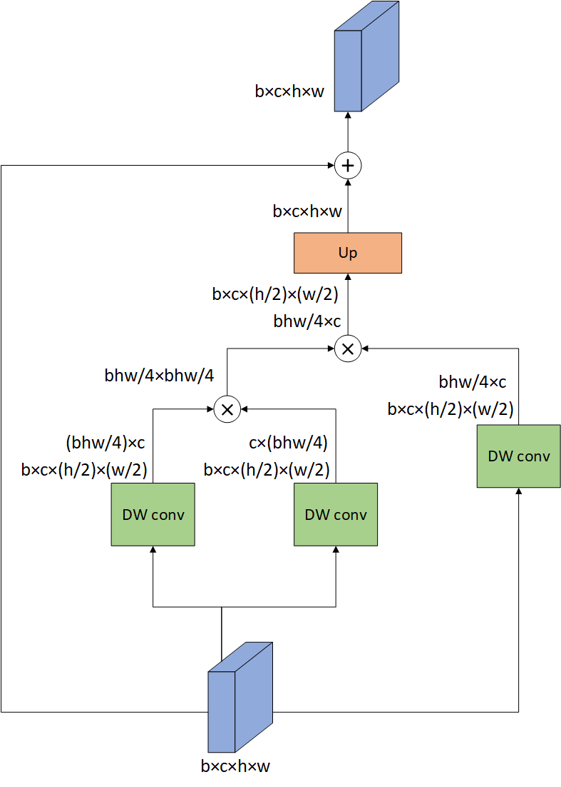

# BNDCNet: Bilateral Nonlocal Decoupled Convergence Network for Semantic Segmentation

### Module Introduction
BNDC is a **end-to-end** module that is able to adapt itself to different sized inputs. 

The **module structure** is shown below:


The structure of the two mini-modules inter-channel and intra-channel is shown below:



Given an input feature map, the output feature map has the same shape and size.

This can be checked with the following code：
  ```
  print(feature_map.shape)
  ```

### Direct Use Methods

1. Place file **BNDCModule.py** in the same folder as the model.py.

2. In the model file, **import** the module as follows:
  ```
  from BNDCModule.py import BNDC
  ```

3. In the **__init__** function of the model, define it as follows:
  ```
  self.bndc = BNDC(channel)
  ```
&ensp;&ensp;where channel is the number of **channels of the feature map**

4. In the **forward** function, do the forward propagation as follows:
  ```
  map = self.bndc(map)
  ```

### Full Usage

The **models folder** gives the complete structure:

&ensp;&ensp;```BiseNet.py``` is the structural implementation of BiseNet
  
&ensp;&ensp;```BNDCModule.py``` is the structural implementation of BNDC
  
&ensp;&ensp;Insert the modules in the same way as the **Direct Use Methods**.

### Treatment of special shape tensor

In the source code, we give the forward approach for **three cases** (line52 - line60)

* Feature map with ```height:width=1:1```
* Feature map with ```height:width=2:1```
* Feature map with ```height:width=1:2```

If your feature map has a more specialized shape, consider setting the step size of the **Inter_channel** module differently (refer to **line52 - line60**).


